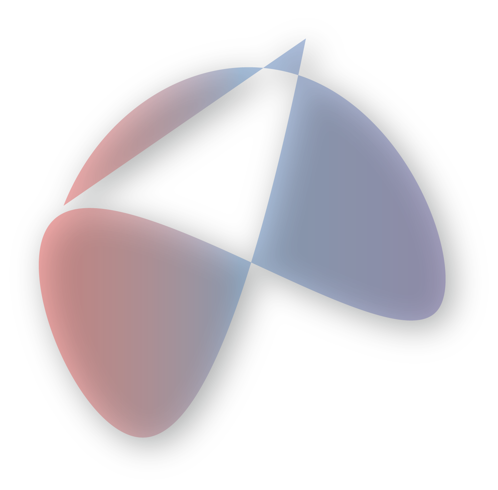

## CodeXR

## Installing
### BETA INSTALL
You can install the Beta CodeXR Visual Studio Code extension from: <a href='https://marketplace.visualstudio.com/items?itemName=nekumelon.codexr'>Marketplace</a> \
Keep in mind that since CodeXR is in beta, it will be buggy, have a lot of down time, and sometimes may not even work at all. If you experience any issues, bugs, or have any suggestions, please feel free to send an email to me at `nekumelon@gmail.com`, report it in the Discord, or open an issue on the GitHub. \
If you receive a completion that doesn't match the prompt, please take a screenshot of both the prompt and completion, and send it to me, as it allows me to tweak the base prompt that CodeXR uses to get the best results from the API.

## Usage
To use CodeXR, start typing your code into the editor, and once you have finished typing your request or snippet, a completion item will show up. You can click tab or enter to accept it and it will be edited into the document.
To activate CodeXR from a keybind (To query the API), the default keybinding is cmd+enter (Windows and Mac). This can be changed in the vscode keybind preferences by going to the vscode preferences menu, selecting `Keyboard Shortcuts`, typing in `CodeXR` and typing in the new keyboard shortcut.

## Best Practices
To get the best out of CodeXR, you should:
* Split large functions into many, smaller functions.
* Use prompts that are self explanatory.
* Use comments to explain your code.

## Terms of Use
CodeXR uses OpenAIs Codex AI model. This means the following terms must be followed AT ALL TIMES.
* CodeXR MUST NOT be used for reasons other than code completion. This means conversing with the AI and manipulating the AI are prohibited.
* CodeXR MUST NOT be used to generate code that may be offensive to anyone.
* Code generated by CodeXR MUST NOT be automatically executed on completion. This means all code generated should be reviewed before building, distributing, or publishing.
* Code generated by CodeXR MUST NOT be automatically posted to any sites. This means automatically posting code to social media, live streams, or videos is prohibited, along with any other sites the code may be posted on.

## Content Warning
CodeXR is a tool for code completions, but it uses an AI System that may product offensive content. If this happens, you may report the completion by sending an email to `nekumelon@gmail.com`, reporting it in the Discord, or by opening an issue on the GitHub. Make sure to include the completion AND the prompt in your report.

## Data Privacy
CodeXR is dedicated to protecting your data, and making sure that the end-user knows exactly what data is collected. There's a saying that `If you aren't paying for it, you're the product`. And although this quote is from the 70s, it sadly still holds up today. However, CodeXR is TRULY FREE. CodeXR is hosted with free services, so selling your information is never going to happen. \
The following information is stored in the database about each user:
* User ID: A 36 character randomly generated ID that represents the user.
* Usage: The number of times the user has queried the CodeXR API.
* Tokens: The number of tokens the user has queried with.
* FlaggedCompletions: The number of completions the user has queried that have been flagged by the content-filter.
* Ip: The IP address of the user.

The following information is collected AS A WHOLE, not about each individual user:
* The number of times the API has been queried.
* The number of errors the server has produced.
* The size of the data sent to the API.

The following information IS NOT collected about each user:
* The prompts sent to the API, this means the context code and the current line of code.
* Personally identifying information about each user, such as their name, email, phone number, GitHub, etc.

Unlike other Completion extensions such as GitHub Copilot and Kite, CodeXR is completely anonymous, safe, and light weight. \
If you ever have a question or concern about CodeXR's data privacy policy, contact me at nekumelon@gmail.com.

## Resources
 \
<a href='https://codexr-app.firebaseapp.com'>Website</a>

## Documentation
99% of the documentation in CodeXR was made by `https://github.com/nekumelon/CodeDoc`
## Badges

## Author
- [@nekumelon](https://www.github.com/nekumelon)

## Support
For support, email nekumelon@gmail.com.